# 智能化停车场管理系统(文末获取方式☟)
> 
#### 介绍
智能化停车场管理系统(Java_Servlet_JSP)
有BUG可留言加微

#### 软件架构
Java + Servlet + JSP + Mysql

#### 项目功能说明

> + 角色信息管理：添加角色信息、管理角色信息
> + 用户信息管理：添加用户信息、管理用户信息
> + 车位信息管理：添加车位信息、管理车位信息
> + IC卡信息管理：添加IC卡类型、管理IC卡类型
> + 固定车主停车管理：出入场设置、停车信息管理
> + 临时车辆停车管理：车主入场信息、车主出场信息
> + 系统功能操作：修改密码、退出系统

### 部分功能演示
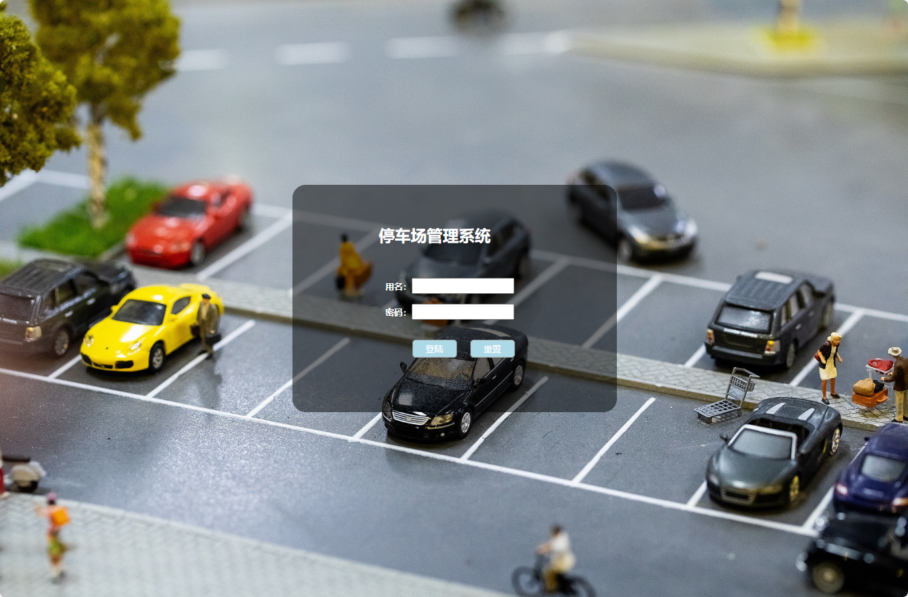
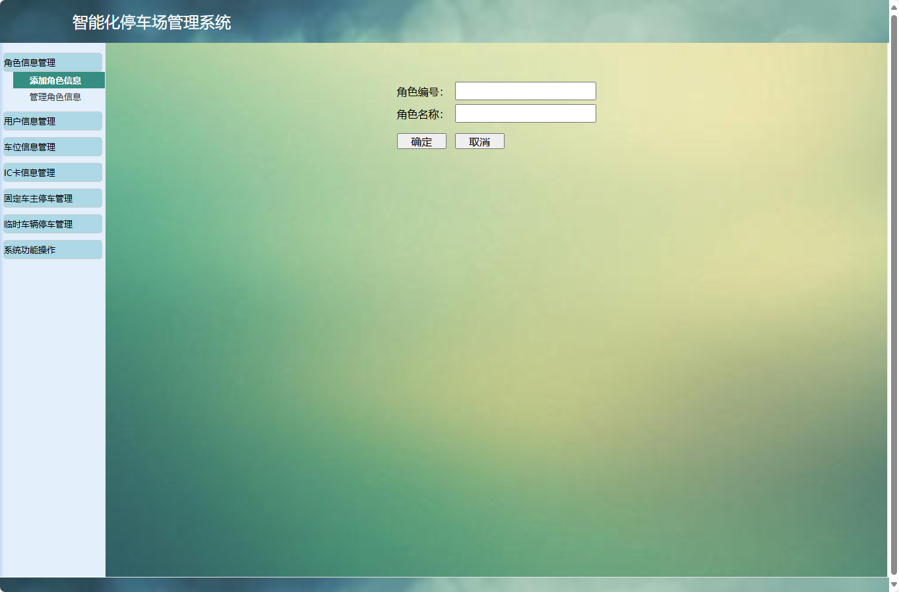
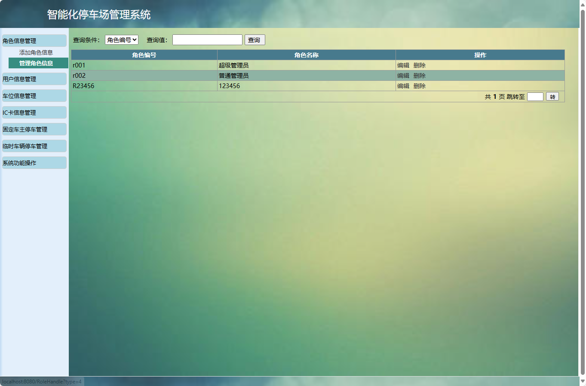

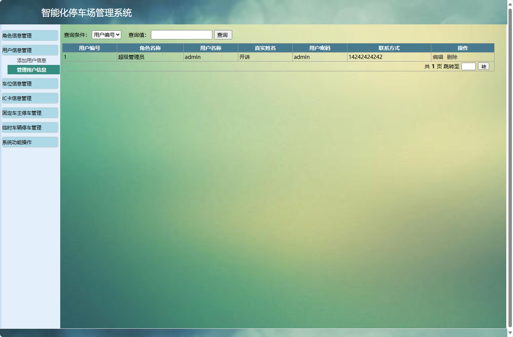
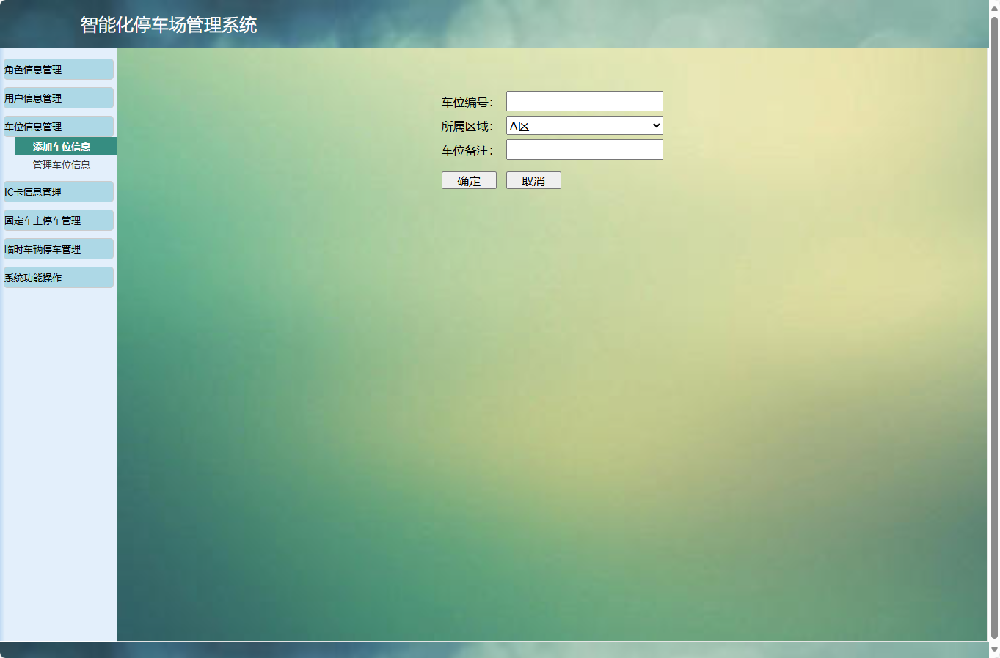
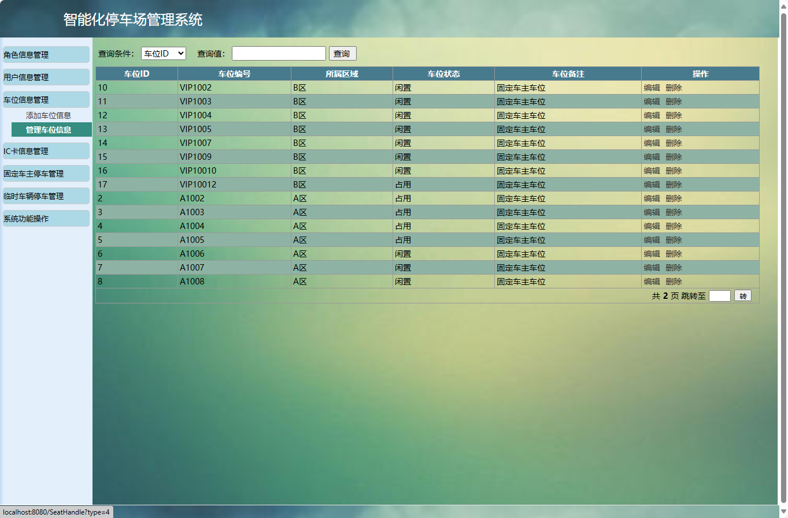
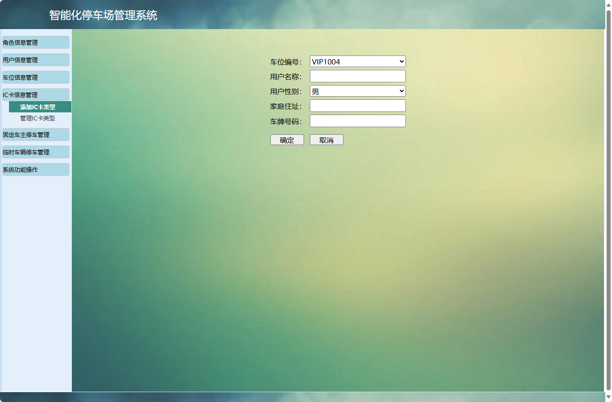
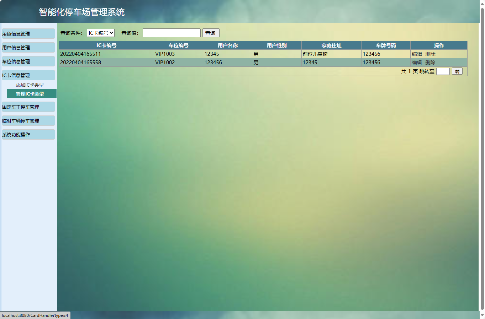
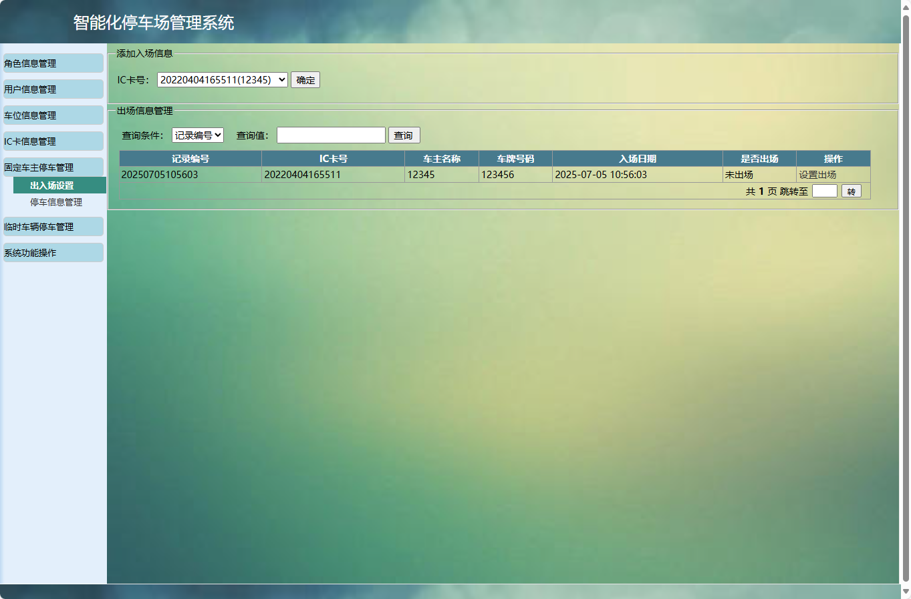
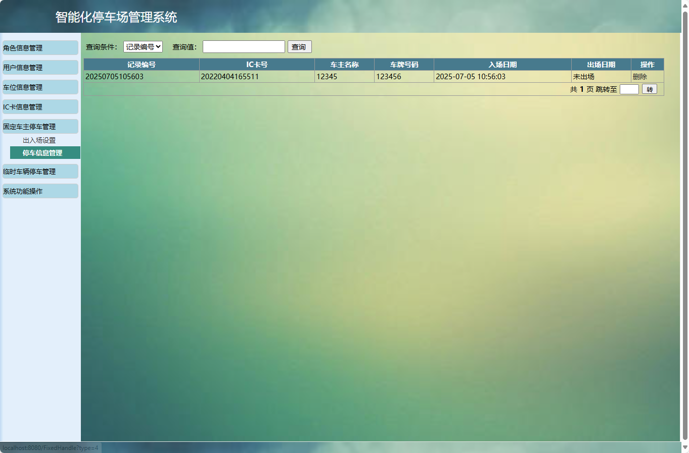
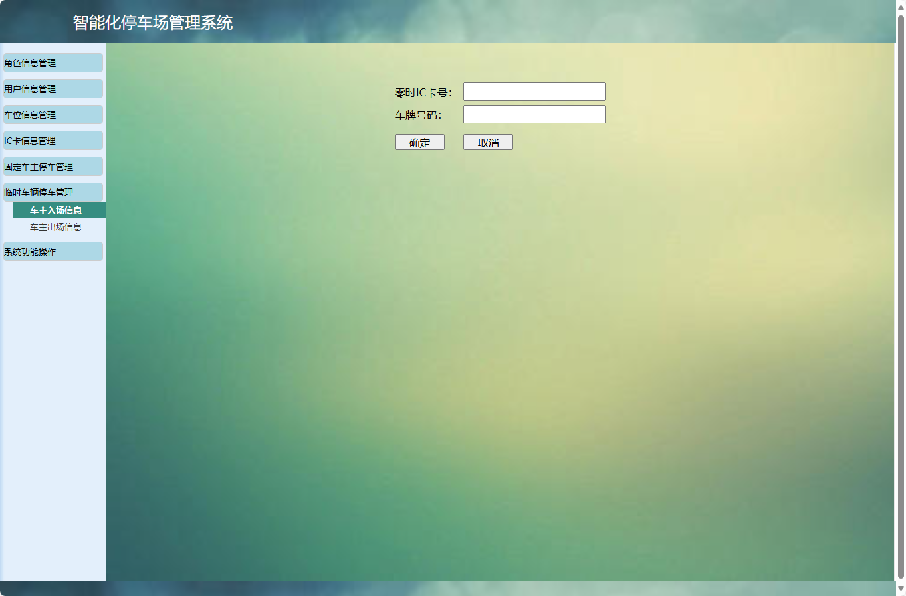
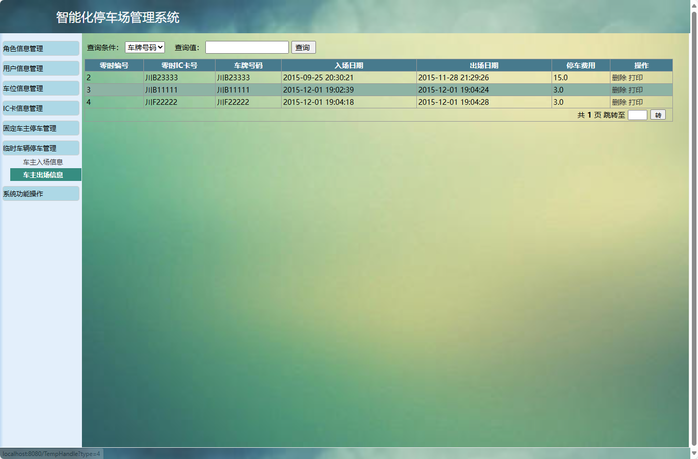
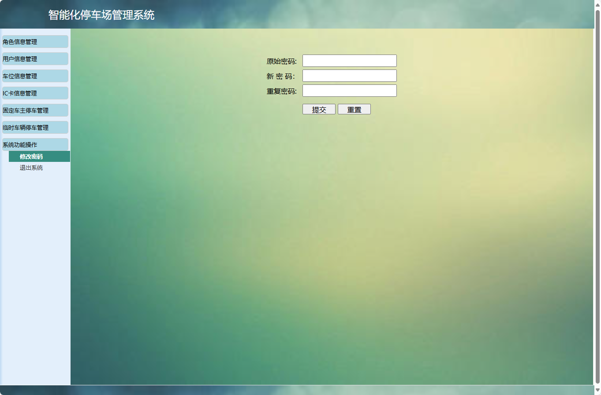

### 环境需求(可免费提供)
- idea/eclipse、jdk-1.8、maven-3.8.6、mysql、node.js等

## 有项目修改、安装调试需求 请联系以下

## 获取资源扫☝☝☝

